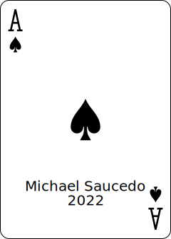

# High Card

Open [High Card](https://highcard.netlify.app/) to view it in your browser.

This is a high card game you can use in place of say, a coin flip. It builds a full 52 card deck, does a random shuffle, cuts the cards and flips over the first card on each half. I use two separate decks with differant color backs. Also an old fashioned style is used as well.

Thanks for reading,

Copyright 2022 Michael Saucedo

 

    

